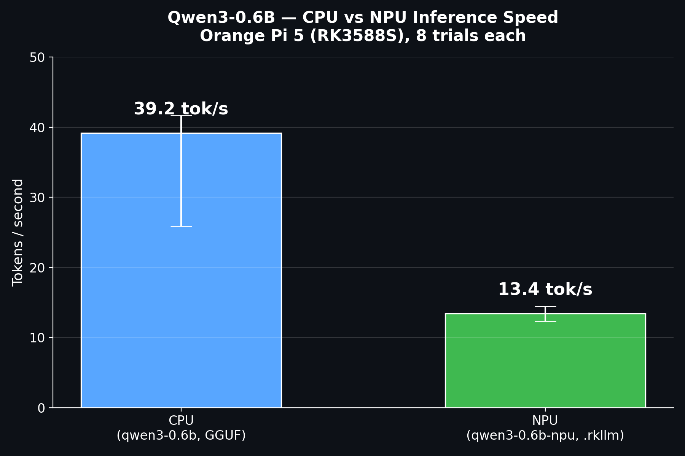

# Rotondo Farms NPU — Arm AI Optimization Challenge

An edge AI plant health monitoring system running on the Orange Pi 5 (Rockchip RK3588S), demonstrating LLM inference optimization from CPU to NPU.

**Track:** Physical AI

**Demo video:** https://youtu.be/mhgFhElPhOE
**Repo:** https://github.com/Nicholas-Rotondo/rotondo-farms-npu

## Project Overview

Rotondo Farms is a real, physical indoor grow-cabinet monitoring system. Capacitive soil moisture sensors feed live readings into an Orange Pi 5, which runs a locally-hosted, quantized LLM (Qwen3-0.6B) to generate natural-language plant health narrations directly from sensor data — no cloud API calls, fully on-device.

The core question this submission answers: for a small, real-time inference workload like this, does running the model on the RK3588S NPU actually outperform running it on CPU — and if not, why not?

## Functionality

- Reads live raw ADC values from capacitive soil moisture sensors via an ADS1115 (I2C), connected directly to the Orange Pi 5.
- Classifies each reading as dry / ok / wet against calibrated thresholds.
- Builds a prompt from the live readings and sends it to a locally-hosted RKLLama server running Qwen3-0.6B, on either CPU (GGUF format) or the RK3588S NPU (native `.rkllm` format).
- Returns a short natural-language narration of plant health, e.g.:
  > "The sensor readings indicate that the Tomato is at a dry state... while the Pepper is healthy... requires attention to maintain soil health."
- Logs every inference call's timing and token counts to a CSV for benchmarking.
- Includes a `--trials` benchmark mode that runs N back-to-back generations against a fixed prompt, for a controlled, repeatable CPU-vs-NPU comparison.

## Benchmark Results

8 trials each, identical fixed prompt, same hardware, same model (Qwen3-0.6B):

| Mode | Format | Avg tok/s | Range |
|---|---|---|---|
| CPU (llama.cpp backend) | GGUF | **39.15** | 25.9 – 41.7 |
| NPU (RKLLama/RKLLM) | native `.rkllm`, W8A8 | **13.43** | 12.4 – 14.4 |



**CPU outperformed the NPU for this model size.** The most likely explanation: at 0.6B parameters, the model is small enough that the NPU's per-request dispatch and initialization overhead outweighs its parallel-processing advantage over a full generation. NPU acceleration is expected to show more benefit on larger models or batched workloads, not single small requests like this. This is a genuine, useful optimization finding for anyone deciding whether NPU offload is worth the added complexity for a given workload size — not every model benefits from NPU acceleration equally, and knowing where the crossover point is matters as much as knowing the NPU exists.

## Technical Challenges / What We Optimized

Getting a model to genuinely run on the NPU — not silently fall back to CPU — required real debugging, not just following a tutorial:

1. **GGUF-on-NPU never actually engaged the NPU.** The first working setup used a GGUF-format model, which appeared to work but was confirmed (via `/sys/kernel/debug/rknpu/load` staying at 0%) to be running entirely on CPU. GGUF-on-NPU support in RKLLama is explicitly experimental.
2. **Switched to the natively-supported `.rkllm` format**, which achieved real NPU utilization (confirmed 3–50% load) — but generation began truncating mid-sentence, consistently, across three different model files and sizes.
3. **Root-caused the truncation to a runtime/library ABI mismatch.** RKLLM runtime `1.3.0`/`1.2.3` produce corrupted or truncated generation on this hardware; runtime `1.2.1` is stable. Critically, pairing the older runtime library with newer application code (which had a different C struct layout for `RKLLMExtendParam`) silently corrupted a parameter passed into the native library. Fixed by pinning both the runtime `.so` and the RKLLama application code to the last mutually-compatible commit.
4. **Also diagnosed and fixed:** a background `systemd` service silently competing for port 8080 with manually-started test instances, and a pipeline bug where the model wasn't being explicitly reloaded between requests.

## Hardware

- Orange Pi 5 4GB (Rockchip RK3588S, 6 TOPS NPU)
- ADS1115 ADC (I2C)
- Capacitive soil moisture sensors (currently: 2 active — tomato, pepper)
- Raspberry Pi Zero 2W — legacy/future sensor node, not part of this NPU inference pipeline
- 4-channel relay module, float sensor, submersible pump — self-watering hardware (separate subsystem, wiring complete, not yet part of this benchmark)

## Stack

- **OS:** Armbian, vendor kernel 6.1.115-vendor-rk35xx
- **NPU Driver:** RKNPU v0.9.8
- **LLM Runtime:** RKLLama + RKLLM runtime **v1.2.1** (pinned — see Technical Challenges above)
- **CPU Baseline:** llama.cpp (GGUF backend)
- **Model:** Qwen3-0.6B — W8A8 quantization (`.rkllm`, NPU) / GGUF (CPU)

## Architecture

The Orange Pi 5 reads soil moisture directly over I2C from the ADS1115, builds a prompt from the live readings, and sends it to a locally-hosted RKLLama server (also running on the Orange Pi 5) for inference — either on CPU or NPU depending on which model is requested. Everything runs on a single device; no external polling or network dependency for the core inference loop.

## Setup / Build / Run Instructions (Arm64 — Orange Pi 5, RK3588S)

**Hardware required:**
- Orange Pi 5 (RK3588S), Armbian, kernel 6.1.115-vendor-rk35xx
- ADS1115 ADC breakout, address `0x48`, wired to i2c-5 (header pins 3/5)
- 1–4 capacitive soil moisture sensors on ADS1115 channels A0–A3

**Software setup:**
```bash
git clone https://github.com/Nicholas-Rotondo/rotondo-farms-npu
cd rotondo-farms-npu

# Set up RKLLama (NPU inference server) — see https://github.com/NotPunchnox/rkllama
python3 -m venv rkllama-env
source rkllama-env/bin/activate
pip install requests smbus2

# Pull the NPU model (native .rkllm format)
rkllama_client pull
#   Repo ID: dulimov/Qwen3-0.6B-rk3588-1.2.1-unsloth
#   File: Qwen3-0.6B-rk3588-w8a8-opt-1-hybrid-ratio-0.0.rkllm
#   Custom Model Name: qwen3-0.6b-npu

# Start the RKLLama server
rkllama_server --models ~/models --llamacpp <path-to-llama.cpp-build>/bin
```

**Running the pipeline:**
```bash
python3 scripts/sensor_narration.py
# single run: reads live sensors, prints narration

python3 scripts/sensor_narration.py --loop 14400
# continuous mode, runs every 4 hours

python3 scripts/sensor_narration.py --model qwen3-0.6b --trials 8
python3 scripts/sensor_narration.py --model qwen3-0.6b-npu --trials 8
# benchmark mode: N trials against a fixed prompt, logs to npu_benchmark.csv
```

**Validating it worked:**
- Console output shows live sensor readings per channel, followed by a full natural-language narration.
- `npu_benchmark.csv` accumulates one row per inference call with timestamp, model, token counts, elapsed time, and tokens/sec.
- NPU utilization can be independently confirmed via: `cat /sys/kernel/debug/rknpu/load`

## License

MIT
